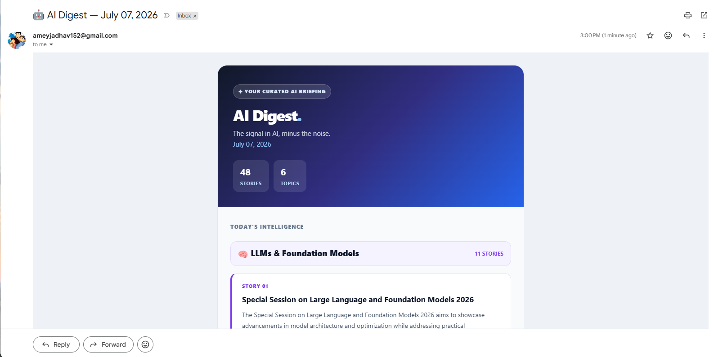

# AI Digest Agent

An autonomous AI agent that searches the web for the latest AI news, summarizes it using an LLM, and delivers a clean HTML newsletter to your inbox every 3 days fully automated via GitHub Actions.


---

## Sample Output



> A clean HTML digest delivered to your inbox every 3 days, grouped by topic with AI-generated summaries and source links.

```
AI Digest - July 06, 2026
39 articles across 6 topics

LLMs & Foundation Models (11 articles)
MLOps & AI Engineering (7 articles)
AI Research Papers (8 articles)
Indian AI Ecosystem (4 articles)
GenAI Tools & Products (6 articles)
AI Jobs & Career (3 articles)
```

---

## Architecture

```
GitHub Actions (every 3 days)
        │
        ▼
   agent.py (orchestrator)
        │
        ├── search/tavily_searcher.py   → Tavily API (dynamic web search)
        ├── search/rss_fetcher.py       → RSS feeds (curated sources)
        │         │
        │    deduplicate by URL
        │         │
        ├── synthesis/summarizer.py     → OpenAI GPT-4o-mini (batched async)
        │         │
        ├── delivery/digest_builder.py  → HTML email assembly
        └── delivery/email_sender.py   → Gmail SMTP delivery
```

---

## Features

- **Multi-source search** - Tavily API for dynamic web search + curated RSS feeds for high-quality known sources
- **6 AI topics** - LLMs, MLOps, Research Papers, Indian AI Ecosystem, GenAI Tools, AI Jobs
- **Batched async summarization** - 10 parallel LLM calls per batch; respects API rate limits
- **Clean HTML digest** - grouped by topic, inline CSS for email client compatibility
- **Plain text fallback** - accessible on all email clients including terminal and mobile
- **Fully automated** - GitHub Actions runs on a cron schedule every 3 days
- **Zero-downtime failures** - graceful degradation if one source fails; rest of digest still sends
- **Secure secrets** - all API keys stored as GitHub Secrets, never in source code

---

## Project Structure

```
ai-digest-agent/
│
├── .github/
│   └── workflows/
│       └── newsletter.yml      # GitHub Actions scheduler (every 3 days)
│
├── search/
│   ├── __init__.py
│   ├── tavily_searcher.py      # Tavily API - dynamic web search per topic
│   └── rss_fetcher.py          # RSS feed parser - curated high-quality sources
│
├── synthesis/
│   ├── __init__.py
│   └── summarizer.py           # Batched async LLM summarization
│
├── delivery/
│   ├── __init__.py
│   ├── digest_builder.py       # HTML email assembly, grouped by topic
│   └── email_sender.py         # Gmail SMTP delivery with plain text fallback
│
├── agent.py                    # Main orchestrator - ties all layers together
├── config.py                   # Single source of truth for all constants
├── requirements.txt            # Pinned dependencies
├── .env.example                # Template for local environment setup
└── .gitignore                  # Ensures .env is never committed
```

---

## Tech Stack

| Component | Technology | Why |
|---|---|---|
| Web search | Tavily API | Returns clean extracted text, built for LLM agents |
| RSS parsing | feedparser | Free, no rate limits, reliable for known sources |
| Summarization | OpenAI GPT-4o-mini | Fast, cheap, high quality for digest summarization |
| Email delivery | Gmail SMTP | Free, no third-party dependency, sufficient for personal use |
| Scheduling | GitHub Actions | Free, serverless, no server to manage |
| Secret management | GitHub Secrets | Encrypted at rest, injected at runtime, never in code |

---

## Local Setup

### 1. Clone the repository

```bash
git clone https://github.com/your-username/ai-digest-agent.git
cd ai-digest-agent
```

### 2. Create a virtual environment

```bash
python -m venv .venv

# Windows
.venv\Scripts\activate

# Mac/Linux
source .venv/bin/activate
```

### 3. Install dependencies

```bash
pip install -r requirements.txt
```

### 4. Configure environment variables

```bash
cp .env.example .env
```

Edit `.env` with your actual keys:

```bash
TAVILY_API_KEY=tvly-xxxxxxxxxxxxxxxxxxxx
OPENAI_API_KEY=sk-xxxxxxxxxxxxxxxxxxxx
GMAIL_ADDRESS=youremail@gmail.com
GMAIL_APP_PASSWORD=xxxx-xxxx-xxxx-xxxx
RECIPIENT_EMAIL=youremail@gmail.com
```

### 5. Run locally

```bash
python agent.py
```

Check your inbox. The digest should arrive within 2-3 minutes.

---

## Getting API Keys

| Key | Where to get it | Free tier |
|---|---|---|
| `TAVILY_API_KEY` | [app.tavily.com](https://app.tavily.com) | 1,000 searches/month |
| `OPENAI_API_KEY` | [platform.openai.com](https://platform.openai.com) | Pay per use (very cheap) |
| `GMAIL_APP_PASSWORD` | [myaccount.google.com/apppasswords](https://myaccount.google.com/apppasswords) | Free (requires 2FA) |

> **Gmail App Password:** You must have 2-Factor Authentication enabled on your Google account before generating an App Password. This is a scoped credential - it can only send email, not access the rest of your account.

---

## GitHub Actions Deployment

### 1. Push to GitHub

```bash
git add .
git commit -m "feat: initial AI digest agent"
git push origin main
```

### 2. Add secrets to GitHub

Go to your repository → **Settings → Secrets and variables → Actions → New repository secret**

Add all 5 secrets:

```
TAVILY_API_KEY
OPENAI_API_KEY
GMAIL_ADDRESS
GMAIL_APP_PASSWORD
RECIPIENT_EMAIL
```

### 3. Test immediately (don't wait 3 days)

Go to **Actions tab → AI Digest Newsletter → Run workflow → Run workflow**

Watch the logs in real time. Check your inbox 2-3 minutes later.

### 4. Automatic schedule

The workflow runs automatically on this cron schedule:

```
0 8 */3 * *   →   every 3 days at 8:00 AM UTC (1:30 PM IST)
```

---

## Roadmap

- [ ] Add Slack/Telegram delivery option
- [ ] Topic filtering - only send topics with 3+ articles
- [ ] Deduplication across runs - don't resurface articles from previous digests
- [ ] Relevance scoring - rank articles by quality before summarizing
- [ ] Web UI - browse past digests in a simple dashboard

---

## License

MIT License - free to use, modify, and distribute.

---

*Built as part of an AI Engineering portfolio. Stack: Python · OpenAI · Tavily · feedparser · Gmail SMTP · GitHub Actions*
